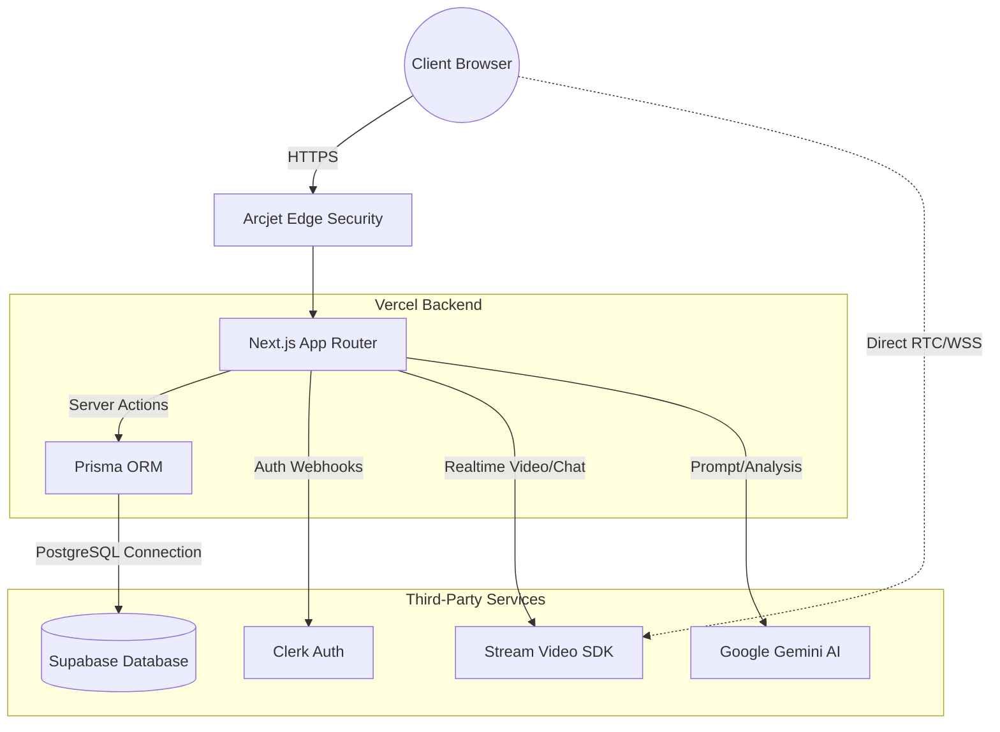

# InterviewEdge 🎯

**[🚀 View Live Demo](https://interview-ai-iota-ashen.vercel.app)**

> A full-stack AI-powered interview preparation platform — built by **[Mathi Sankar](https://mathi-sankar.github.io/portfolio)**

InterviewEdge connects aspiring engineers with experienced senior developers from top tech companies for 1:1 mock interviews. It features AI-generated questions, HD video calls, slot-based scheduling, and post-interview AI feedback reports.

---

## ✨ Features

- 🤖 **AI Question Generator** — Role-specific questions (DSA, System Design, Behavioural) generated on demand during live sessions
- 📹 **HD Video Calls** — Powered by [Stream](https://getstream.io/) with screen sharing and recording
- 💬 **Persistent Chat** — Pre/post-interview messaging between interviewer and interviewee
- 📊 **AI Feedback Reports** — Post-interview analysis via Gemini with actionable insights
- 🗓️ **Slot-based Scheduling** — Interviewers set availability, candidates book open slots in one click
- 💳 **Credit System** — Monthly subscriptions; interviewers earn and withdraw credits anytime
- 🔒 **Security by Arcjet** — Bot protection, rate limiting, and abuse prevention on every API route

---

## 🛠️ Tech Stack

| Layer | Technology |
|---|---|
| Framework | [Next.js 15](https://nextjs.org/) (App Router) |
| Auth | [Clerk](https://clerk.com/) |
| Database | [Supabase](https://supabase.com/) + [Prisma ORM](https://www.prisma.io/) |
| Video/Chat | [Stream](https://getstream.io/) |
| AI | [Google Gemini](https://ai.google.dev/) |
| Styling | [Tailwind CSS](https://tailwindcss.com/) + [Shadcn UI](https://ui.shadcn.com/) |
| Security | [Arcjet](https://arcjet.com/) |
| Deployment | [Vercel](https://vercel.com/) |

---

## 🏗️ System Architecture



---

## 🚀 Getting Started

### Prerequisites

- Node.js 18+
- A [Clerk](https://clerk.com/) account
- A [Supabase](https://supabase.com/) project
- A [Stream](https://getstream.io/) account
- A [Google Gemini](https://ai.google.dev/) API key
- An [Arcjet](https://arcjet.com/) account

### 1. Clone the repository

```bash
git clone https://github.com/Mathi-Sankar/interview-ai.git
cd interview-ai
```

### 2. Install dependencies

```bash
npm install
```

### 3. Configure environment variables

Create a `.env` file in the project root:

```env
# Clerk Auth
NEXT_PUBLIC_CLERK_PUBLISHABLE_KEY=
CLERK_SECRET_KEY=
NEXT_PUBLIC_CLERK_SIGN_IN_URL=/sign-in
NEXT_PUBLIC_CLERK_SIGN_UP_URL=/sign-up

# Database (Supabase / PostgreSQL)
DATABASE_URL=

# Stream (Video & Chat)
NEXT_PUBLIC_STREAM_API_KEY=
STREAM_SECRET_KEY=

# Google Gemini AI
GEMINI_API_KEY=

# Arcjet Security
ARCJET_KEY=

# App URL
NEXT_PUBLIC_APP_URL=http://localhost:3000
```

### 4. Run database migrations

```bash
npx prisma migrate dev
```

### 5. Start the development server

```bash
npm run dev
```

Open [http://localhost:3000](http://localhost:3000) to view the app.

---

## 📁 Project Structure

```
interview-ai/
├── app/                  # Next.js App Router pages
│   ├── (auth)/           # Sign-in / Sign-up pages
│   ├── (main)/           # Protected app pages
│   │   ├── dashboard/    # Interviewer dashboard
│   │   ├── explore/      # Browse interviewers
│   │   ├── appointments/ # Manage bookings
│   │   ├── call/         # Live video call room
│   │   └── onboarding/   # User role setup
│   └── api/              # API routes (webhooks)
├── actions/              # Server actions
├── components/           # Reusable UI components
├── lib/                  # Utilities, Prisma, helpers
├── prisma/               # Database schema & migrations
└── public/               # Static assets
```

---

## 🌐 Deployment

This project is deployed on **Vercel**. To deploy your own instance:

1. Push your code to GitHub
2. Import the repo in [Vercel](https://vercel.com/)
3. Add all environment variables in the Vercel dashboard
4. Deploy!

---

## 📄 License

This project is open source and available under the [MIT License](LICENSE).

---
